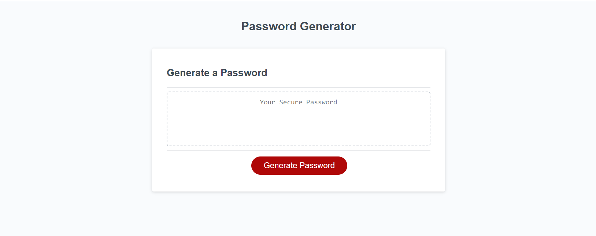

# <Challenge-3>

## Description

Provide a short description explaining the what, why, and how of your project. Use the following questions as a guide:

- The motivation for this project was to create my own password generator depending on what the user chooses. 
- I built this project in order to provide a seemless way to determine what types of characters and password legnth that the user wants.  
- What problem does it solve:
GIVEN I need a new, secure password
WHEN I click the button to generate a password
THEN I am presented with a series of prompts for password criteria
WHEN prompted for password criteria
THEN I select which criteria to include in the password
WHEN prompted for the length of the password
THEN I choose a length of at least 8 characters and no more than 128 characters
WHEN asked for character types to include in the password
THEN I confirm whether or not to include lowercase, uppercase, numeric, and/or special characters
WHEN I answer each prompt
THEN my input should be validated and at least one character type should be selected
WHEN all prompts are answered
THEN a password is generated that matches the selected criteria
WHEN the password is generated
THEN the password is either displayed in an alert or written to the page

- I learned how to use Javascript to interact with the webpage and have both HTML, CSS, and Javascript work together. 

- [Installation](#installation) N/A
- [Usage](#usage) N/A
- [Credits](#credits) None
- [License](#license) MIT

## Installation

Deployed on the github pages 

## Usage

Link to the website can be found here: https://bulkingfire.github.io/Stathatos_Challenge3/
Screenshot:

## Credits

None

## License

MIT

---

🏆 The previous sections are the bare minimum, and your project will ultimately determine the content of this document. You might also want to consider adding the following sections.
